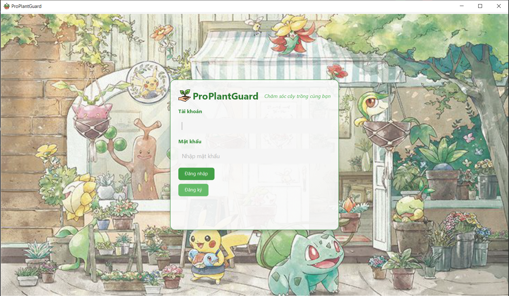
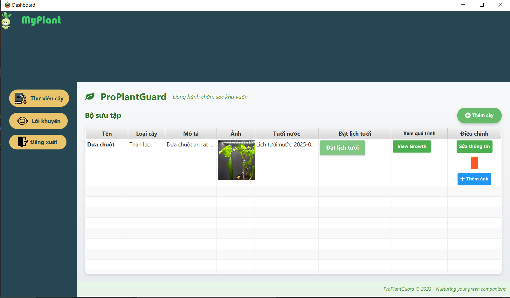
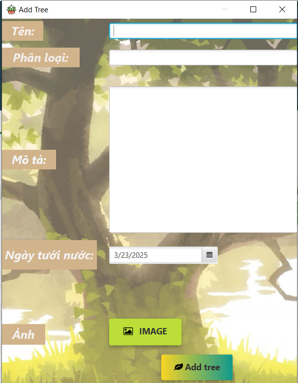
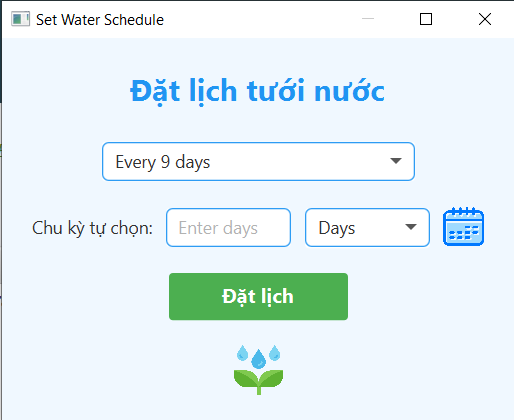
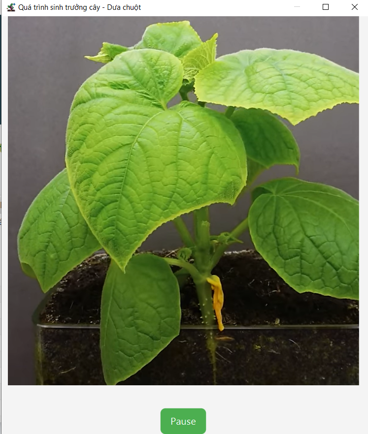
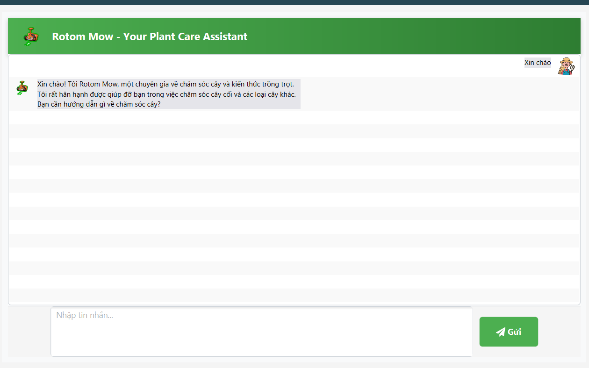

# [ProPlantGuard]

[Mô tả] 

App hỗ trợ chăm sóc cây trồng là một ứng dụng được phát triển nhằm giúp người dùng theo dõi, quản lý và chăm sóc cây trồng một cách hiệu quả. Ứng dụng cung cấp thông tin về các loại cây, nhắc nhở lịch tưới nước, đồng thời đưa lời khuyên hỗ trợ


## Authors

- [@dragonite2631](https://github.com/dragonite2631)


## Demo

Link Video Demo


## Screenshots

Ảnh













## Features

- Các chức năng chính của ứng dụng
    - Đăng nhập/ đăng ký
    - Thêm, sửa, xóa cây
    - Xem quá trình sinh trưởng
    - Đặt lịch tưới nước
    - Chatbot hỗ trợ
## Requirements

- Java 11
- llama3.2

## Installation

Cách cài đặt dự án

```bash
  - Clone dự án
  - Tải ollama
  - Chạy llama 3.2
  - Chạy ProPlantGuardApplication.java
```


## License

[MIT](https://choosealicense.com/licenses/mit/)

